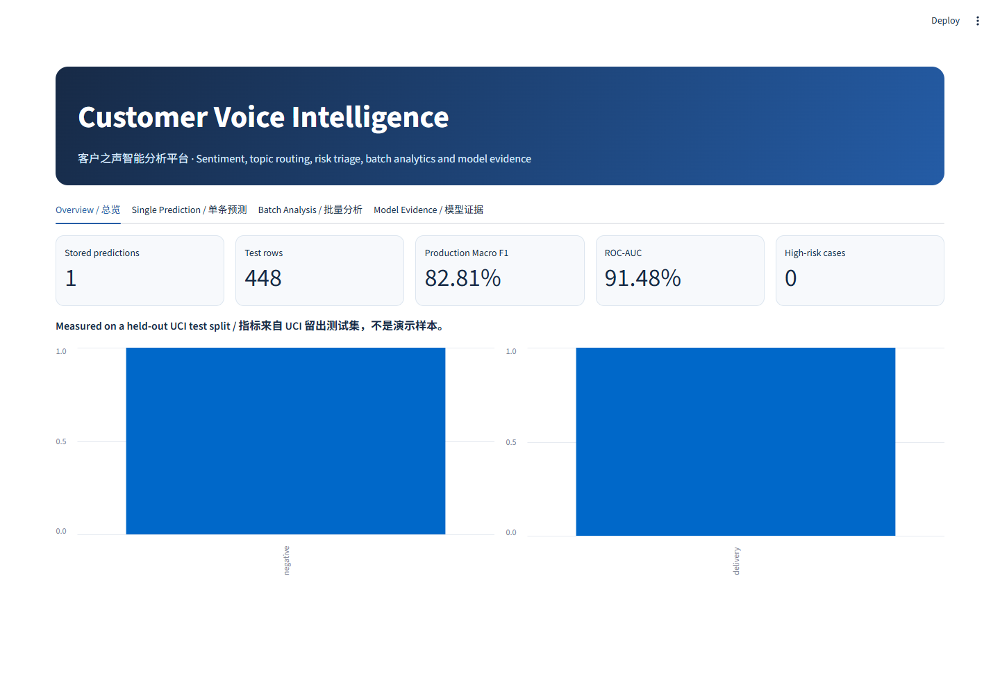
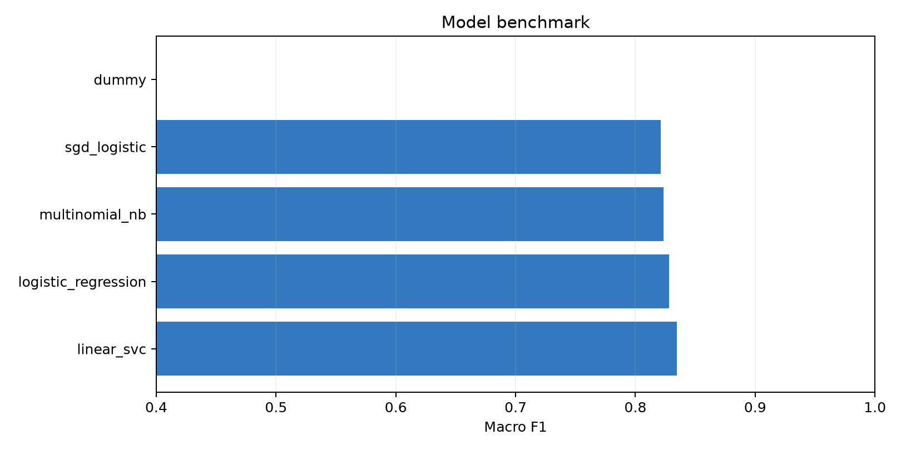
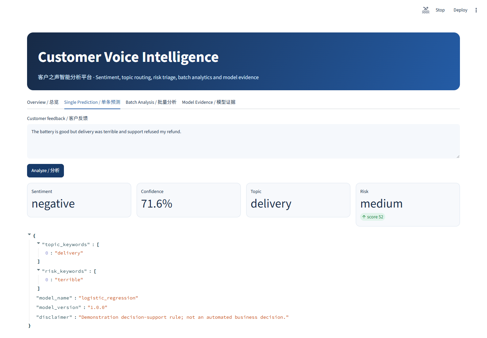
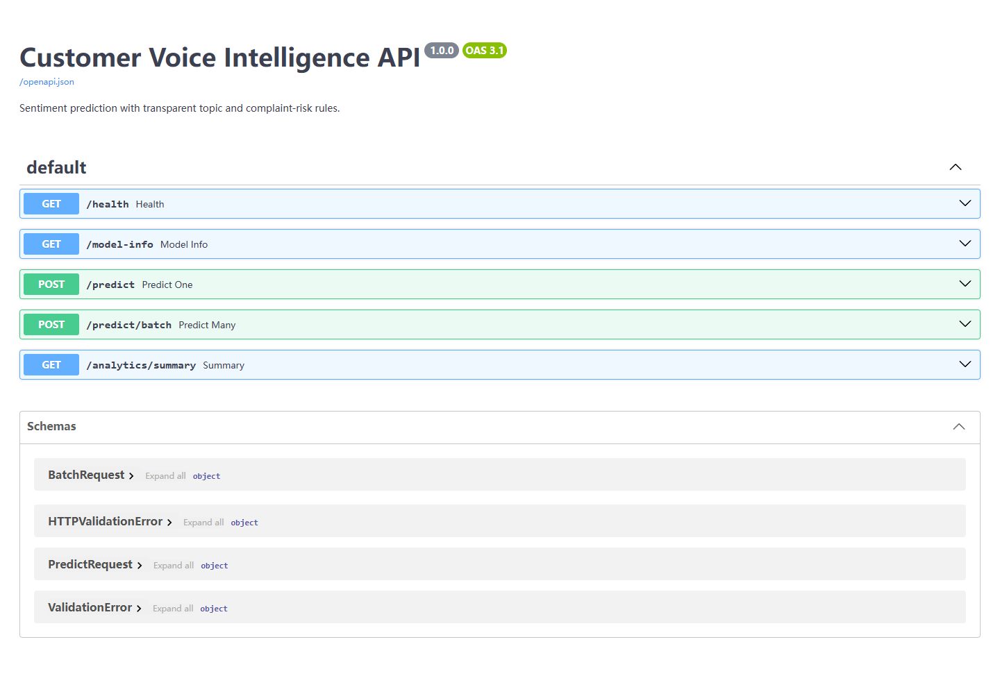
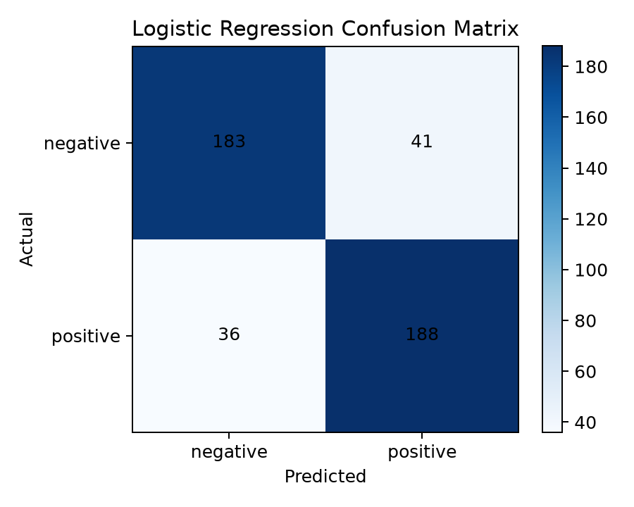
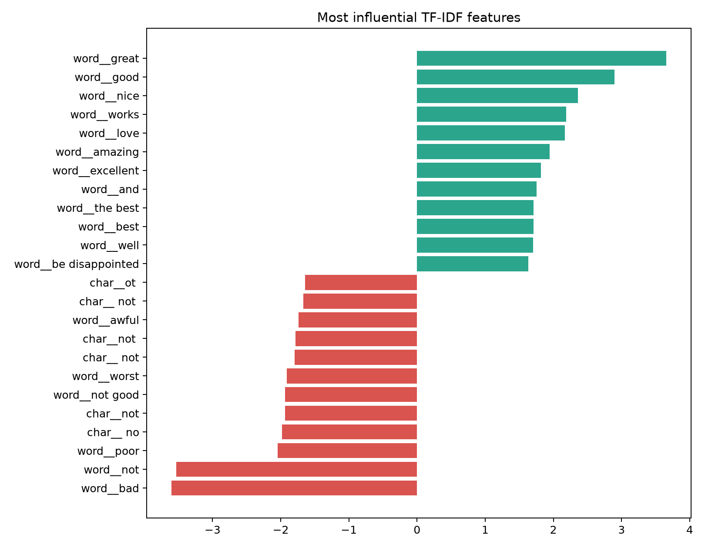
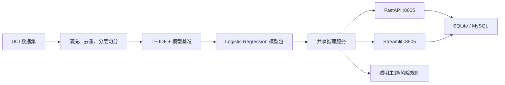

# Customer Voice Intelligence / 客户之声智能分析平台

[中文](#中文说明) · [English](#english)

An end-to-end, evidence-driven NLP portfolio project for sentiment analysis, topic routing, complaint-risk triage, batch analytics and API serving.

一个端到端、以真实实验为依据的 NLP 项目，覆盖情感分析、主题路由、投诉风险分级、批量分析与 API 服务。



## 中文说明

### 项目亮点

- 使用 UCI Sentiment Labelled Sentences 的 2,982 条去重英文评论，而非自造演示数据。
- 对比 Dummy、MultinomialNB、SGD、Logistic Regression 与 LinearSVC 五种方案，并保留交叉验证结果。
- 提供 Accuracy、Precision、Recall、F1、Macro F1、ROC-AUC、PR-AUC、95% Bootstrap 区间、混淆矩阵和误差样本。
- 提供单条/批量预测、FastAPI、Streamlit Dashboard、SQLite 持久化，以及可选 MySQL。
- Docker Compose 一次启动 API、Dashboard 和 MySQL；GitHub Actions 自动重跑数据处理、训练和测试。
- 主题与风险分级是可解释的关键词规则，不伪装成训练模型；风险结果仅用于演示辅助判断。

### 真实实验结果

固定随机种子 42；按 `sentiment + source` 分层切分为 2,087/447/448 条训练、验证和测试数据。下表均来自本仓库代码在留出测试集上的实际运行结果。

| 模型 | Accuracy | Macro F1 | 5-fold CV Macro F1 |
|---|---:|---:|---:|
| LinearSVC | 83.48% | **83.48%** | 82.36% ± 2.13% |
| Logistic Regression | 82.81% | 82.81% | 81.88% ± 2.12% |
| MultinomialNB | 82.37% | 82.36% | 82.06% ± 1.82% |
| SGD Logistic | 82.14% | 82.13% | 81.64% ± 2.22% |
| Dummy | 50.00% | 33.33% | — |

生产示例选择 Logistic Regression：其 Macro F1 只比 LinearSVC 低 0.67 个百分点，但能直接输出概率，便于置信度展示和阈值扩展。其 ROC-AUC 为 91.48%，PR-AUC 为 92.87%，正类 F1 的 95% Bootstrap 区间为 78.84%–86.32%。



### 界面与模型证据

| 单条预测 | FastAPI 文档 |
|---|---|
|  |  |

| 混淆矩阵 | 特征解释 |
|---|---|
|  |  |

### 架构



### 快速开始

需要 Python 3.11+。本机开发可复用项目群根目录的 `.venv`，仓库本身不提交环境目录。

```powershell
pip install -r requirements.txt
python scripts/prepare_data.py
python -m src.benchmark
uvicorn api.main:app --host 0.0.0.0 --port 8005
```

另开终端启动界面：

```powershell
streamlit run dashboard/app.py --server.port 8505
```

- Dashboard: `http://localhost:8505`
- API 文档: `http://localhost:8005/docs`
- 健康检查: `http://localhost:8005/health`

Docker 运行：

```powershell
docker compose up --build
```

测试与复现：

```powershell
pytest -q
python -m src.benchmark
```

### 数据来源与限制

数据来自 [UCI Sentiment Labelled Sentences](https://archive.ics.uci.edu/dataset/331/sentiment%2Blabelled%2Bsentences)，DOI `10.24432/C57604`，许可为 CC BY 4.0。原始 3,000 条 Amazon、IMDb、Yelp 英文句子经确定性流程去除 18 条重复记录；原始压缩包与处理结果由脚本下载/生成，不提交 Git。

当前版本只做英文正/负二分类，没有中性标签；数据规模较小且句子较短。主题路由与风险分级是规则基线，不是监督学习结果，也不应用于自动拒绝、处罚或客服决策。Transformer、MLflow 和云部署留作有真实实验依据后的迭代方向。

## English

### What this project demonstrates

- A reproducible pipeline built on 2,982 deduplicated, real review sentences from UCI.
- Five-model benchmarking with stratified cross-validation and a held-out test set.
- Complete evaluation: accuracy, precision, recall, F1, macro F1, ROC-AUC, PR-AUC, bootstrap confidence interval, confusion matrix and error export.
- Single and batch inference through Streamlit and FastAPI, with SQLite by default and optional MySQL persistence.
- Docker Compose packaging and GitHub Actions reproduction.
- Explicit separation between the trained sentiment model and transparent topic/risk rules.

### Reproduce it

```bash
pip install -r requirements.txt
python scripts/prepare_data.py
python -m src.benchmark
pytest -q
uvicorn api.main:app --host 0.0.0.0 --port 8005
streamlit run dashboard/app.py --server.port 8505
```

The production example uses Logistic Regression for native probabilities, accepting a 0.67 percentage-point macro-F1 trade-off versus LinearSVC. See [experiment details](docs/EXPERIMENTS.md), [model card](docs/MODEL_CARD.md), and [API examples](docs/API.md).

### Repository layout

```text
api/                 FastAPI routes and schemas
dashboard/           Streamlit application
database/            SQLAlchemy storage and MySQL schema
data/                Dataset provenance; generated data is ignored
docs/                 Evidence, screenshots and technical notes
scripts/              Deterministic data preparation
src/                  Preprocessing, training, evaluation and inference
tests/                Unit and API tests
.github/workflows/    Reproducible CI pipeline
```

### License

Project code is released under the MIT License. The UCI dataset retains its own CC BY 4.0 license and attribution requirements.
